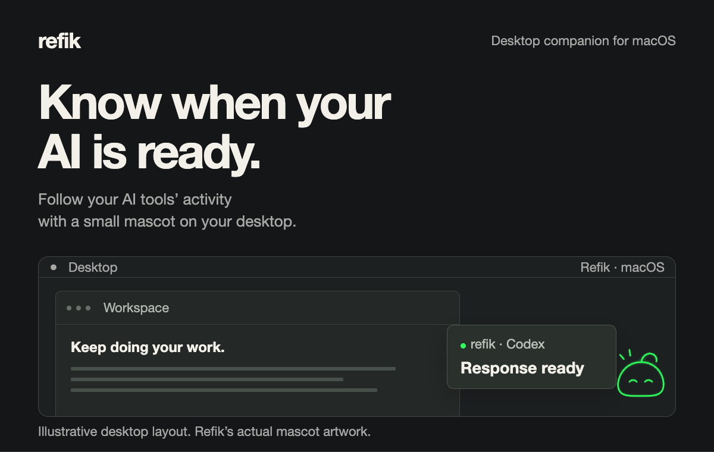
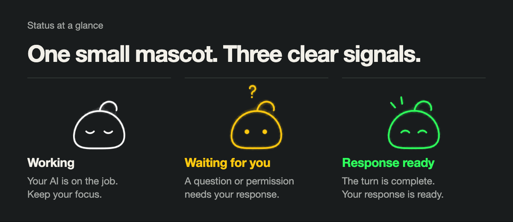
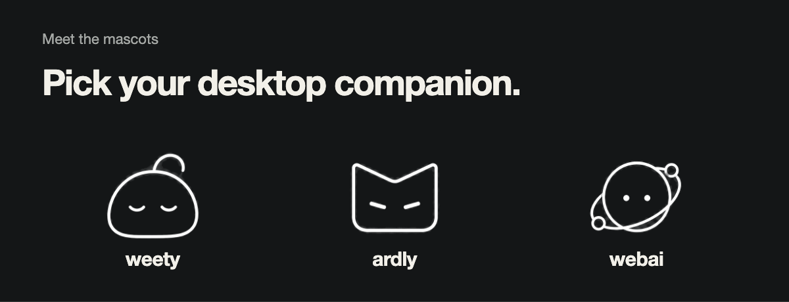

# Refik

**English** · [Türkçe](README.tr.md)



Refik is a native macOS desktop companion that shows when your AI tools are working, waiting for you, or ready with a response. Keep doing your work and check the mascot instead of repeatedly checking every window.

- **See the status at a glance.** White means working, yellow means a question or permission needs attention, and green means a response is ready.
- **Open one activity panel.** Click the mascot to see tracked jobs and their current state.
- **Choose how to be notified.** Completion, waiting, sound and reminder options are available in Settings.
- **Pick your companion.** Choose weety, ardly or webai, and adjust its screen position, opacity and cursor-following eyes.

Features depend on the connected tool and its integration. Refik does not provide every capability for every tool.



## Meet the mascots

Three looks, the same status signals. Choose one in Settings → Appearance.



## Install

**Free beta:** 0.1.0 · macOS 13 or later · Apple Silicon (arm64)

**[Download Refik 0.1.0](https://github.com/metapak/Refik/releases/download/v0.1.0/Refik-0.1.0-macOS-arm64.dmg)** · [Beta release notes](https://github.com/metapak/Refik/releases/tag/v0.1.0)

1. Open the DMG and drag Refik to **Applications**.
2. Launch Refik and connect the tools found by the first-launch setup.
3. Enable notifications in Settings if you want them. macOS asks for notification permission when you enable this option.
4. Start a job in a connected tool. Click the mascot to check its activity.

The current build is ad hoc signed and has not been notarized by Apple. macOS may show an unverified-developer warning.

For terminal jobs, select Terminal.app or iTerm2 on the activity row when needed. Opening an application does not guarantee selecting a particular chat, window or terminal session.

## Current support

This table separates live usage checks from implemented integrations that still need live validation.

| Tool / connection | Available behavior | Validation status |
| --- | --- | --- |
| Codex · Visual Studio Code | Working, waiting and ready states; opening the editor | Live checked |
| Codex CLI · Terminal.app / iTerm2 | Working, waiting and ready states; opening the configured terminal | Live checked |
| Codex Desktop | Activity tracking and opening the app | Some completion/read transitions remain under investigation; exact-chat navigation is unverified |
| Antigravity IDE | Working, waiting and ready states; opening the IDE | Live checked |
| Antigravity CLI · Terminal.app / iTerm2 | Working, waiting and ready states; opening the configured terminal | Live checked |
| Cursor · Grok | Notification flow | Live checked for notifications; question and opening flows are not fully validated |
| Claude Code 2.1.287 | Questions, freeform answers and one-time permission approval/rejection through the panel | Implemented and checked with offline tests; not validated with a live account |
| OpenCode · explicitly connected local API | Questions and permission responses through the panel | Implemented and checked with mock API tests; full real-session validation pending |

When a connection cannot submit an answer, continue in the original tool. Local hooks and editor connections handle the supported integrations; OpenCode uses an explicitly configured localhost API connection.

## Build from source

Requires macOS, a Swift 5.9-compatible toolchain, Node.js 22 or newer, and npm. Run these commands from the repository root. The editor extension packager is installed at its pinned version in an isolated temporary directory.

```sh
swift test
tool_root="$(mktemp -d)"
npm install --prefix "$tool_root" @vscode/vsce@4.0.0 --no-audit --no-fund --ignore-scripts
REFIK_VSCE_CLI="$tool_root/node_modules/@vscode/vsce/vsce" zsh Scripts/build-app.sh --dmg
```

The build script packages the editor extension, builds the arm64 application and creates `dist/refik.dmg`. `REFIK_VSCE_CLI` points to the official VSCE 4.0.0 CLI used only during packaging; no global npm installation is needed.

## License and attribution

Third-party components are subject to the terms in [Third-party notices](THIRD_PARTY_NOTICES.md).

The illustrations use Refik's actual mascot artwork. Desktop layouts are illustrative, and English labels are translated for this README.
