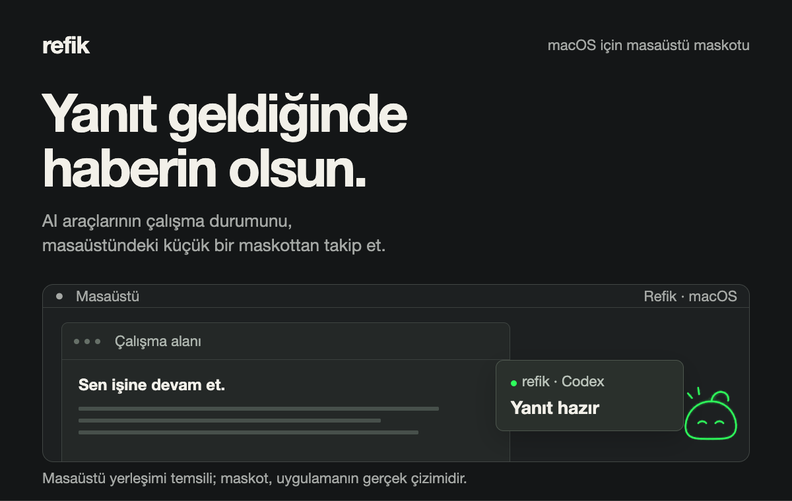
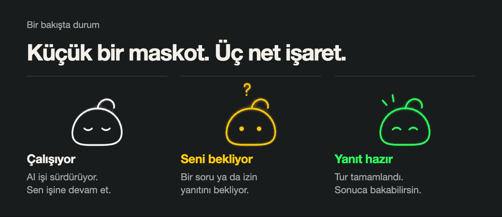

# Refik

[English](README.md) · **Türkçe**



Refik, AI araçlarının çalıştığını, sizi beklediğini veya yanıtın hazır olduğunu masaüstündeki küçük bir maskotla gösteren yerel macOS uygulaması. Her pencereyi tekrar tekrar kontrol etmeden kendi işinize devam edin.

- **Durumu bir bakışta görün.** Beyaz çalışıyor, sarı soru ya da izin bekliyor, yeşil yanıt hazır anlamına gelir.
- **İşleri aynı panelde takip edin.** Maskota tıklayıp izlenen işleri ve durumlarını görün.
- **Bildirimleri kendinize göre ayarlayın.** Tamamlanma, bekleme, ses ve hatırlatma seçeneklerini Ayarlar’dan seçin.
- **Maskotunuzu seçin.** weety, ardly veya webai’yi kullanın; ekran konumunu, opaklığını ve imleci takip eden gözlerini ayarlayın.

Kullanılabilen özellikler araca ve bağlantı biçimine göre değişir. Her araç aynı yetenekleri sunmaz.



## Maskotlar

Üç görünüm, aynı durum renkleri. Ayarlar → Görünüm bölümünden seçebilirsiniz.


## Kurulum

**Ücretsiz beta:** 0.1.0 · macOS 13 ve üzeri · Apple Silicon (arm64)

**[Refik 0.1.0 indir](https://github.com/metapak/Refik/releases/download/v0.1.0/Refik-0.1.0-macOS-arm64.dmg)** · [Beta sürüm notları](https://github.com/metapak/Refik/releases/tag/v0.1.0)

1. DMG’yi açın, Refik’i **Applications / Uygulamalar** klasörüne taşıyın.
2. Refik’i başlatıp ilk kurulumda bulunan araçları bağlayın.
3. Bildirim istiyorsanız Ayarlar’dan açın. macOS bildirim iznini bu seçeneği açtığınızda ister.
4. Bağlı araçta bir iş başlatın. Durumunu görmek için maskota tıklayın.

Mevcut paket ad hoc imzalıdır; Apple noter onayı yoktur. macOS, doğrulanmamış geliştirici uyarısı gösterebilir.

Terminal işleri için gerektiğinde ilgili satırdan Terminal.app veya iTerm2’yi seçin. Uygulamayı açmak, her araçta belirli bir sohbeti, pencereyi veya terminal oturumunu doğrudan seçmek anlamına gelmez.

## Güncel destek durumu

Bu tablo, canlı kullanımda denenen akışları henüz gerçek hesapla doğrulanmayan entegrasyonlardan ayırır.

| Araç / bağlantı | Kullanılabilen işlev | Doğrulama durumu |
| --- | --- | --- |
| Codex · Visual Studio Code | Çalışıyor, bekliyor ve yanıt hazır durumları; editörü açma | Canlı denendi |
| Codex CLI · Terminal.app / iTerm2 | Çalışıyor, bekliyor ve yanıt hazır durumları; seçilen terminali açma | Canlı denendi |
| Codex Desktop | Etkinlik takibi ve uygulamayı açma | Bazı tamamlanma/görüldü geçişleri inceleniyor; belirli sohbete doğrudan geçiş doğrulanmadı |
| Antigravity IDE | Çalışıyor, bekliyor ve yanıt hazır durumları; IDE’yi açma | Canlı denendi |
| Antigravity CLI · Terminal.app / iTerm2 | Çalışıyor, bekliyor ve yanıt hazır durumları; seçilen terminali açma | Canlı denendi |
| Cursor · Grok | Bildirim akışı | Bildirim canlı denendi; soru ve açma akışları tam doğrulanmadı |
| Claude Code 2.1.287 | Panelden soru yanıtlama, serbest yanıt ve tek isteklik izin onaylama/reddetme | Uygulandı ve çevrimdışı testlerle kontrol edildi; gerçek hesapla canlı deneme yapılmadı |
| OpenCode · açıkça bağlanan yerel API | Panelden soru ve izin yanıtları | Uygulandı ve sahte API testleriyle kontrol edildi; gerçek oturumla tam doğrulama bekliyor |

Bağlantı yanıt gönderemiyorsa ilgili araçtan devam edin. Desteklenen entegrasyonlar yerel hook ve editör bağlantılarını kullanır; OpenCode, ayrıca yapılandırılan localhost API bağlantısıyla çalışır.

## Kaynaktan derleme

macOS, Swift 5.9 ile uyumlu araç zinciri, Node.js 22 veya üzeri ve npm gerekir. Komutları deponun kök dizininde çalıştırın. Editör eklentisinin paketleme aracı, sabitlenmiş sürümüyle ayrı bir geçici dizine kurulur.

```sh
swift test
tool_root="$(mktemp -d)"
npm install --prefix "$tool_root" @vscode/vsce@4.0.0 --no-audit --no-fund --ignore-scripts
REFIK_VSCE_CLI="$tool_root/node_modules/@vscode/vsce/vsce" zsh Scripts/build-app.sh --dmg
```

Derleme betiği editör eklentisini paketler, arm64 uygulamayı derler ve `dist/refik.dmg` dosyasını oluşturur. `REFIK_VSCE_CLI`, yalnız paketleme sırasında kullanılan resmi VSCE 4.0.0 komut dosyasını gösterir; global npm kurulumu gerekmez.

## Lisans ve atıf

Üçüncü taraf bileşenlerin koşulları [Üçüncü taraf bildirimleri](THIRD_PARTY_NOTICES.md) dosyasında bulunur.

Görsellerde Refik’in gerçek maskot çizimleri kullanılır. Masaüstü yerleşimleri temsilidir; İngilizce README’deki görsel metinleri o sayfa için çevrilmiştir.
